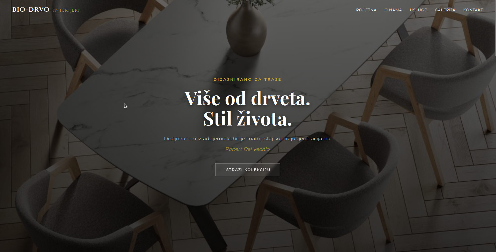
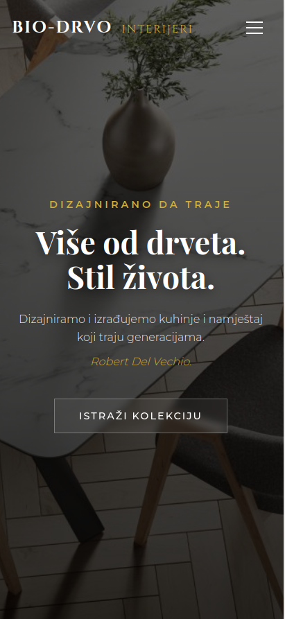

<h1 align="center">Bio Drvo Interijeri</h1>

A landing page built for a potential client. The deal eventually fell through, but the website was already half-done, so I decided to finish it anyway. It now serves as part of my portfolio.

## Links

- [Repo](https://github.com/marinsabo/Bio-Drvo-Interijeri "Bio-Drvo-Interijeri Repo")
- [Live](https://marinsabo.github.io/Bio-Drvo-Interijeri "Live View")

## Screenshots

## Built With

- HTML5
- CSS3
- JavaScript

## AI Usage

I used generative AI as a support tool in this project:

- drafting the page copy, which I then reviewed and edited
- generating the product images
